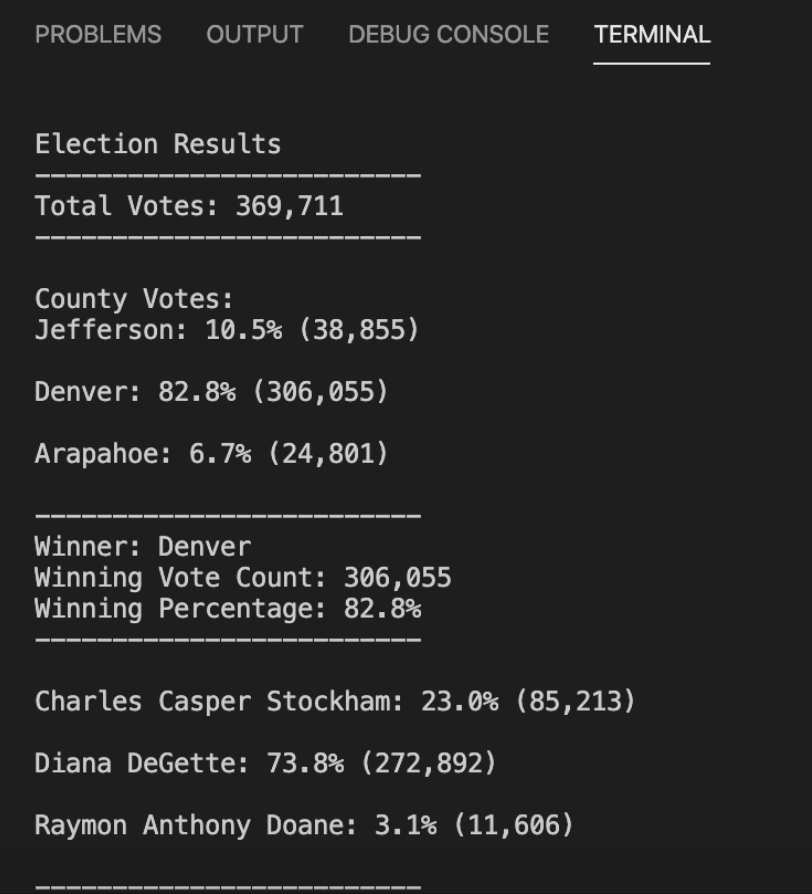
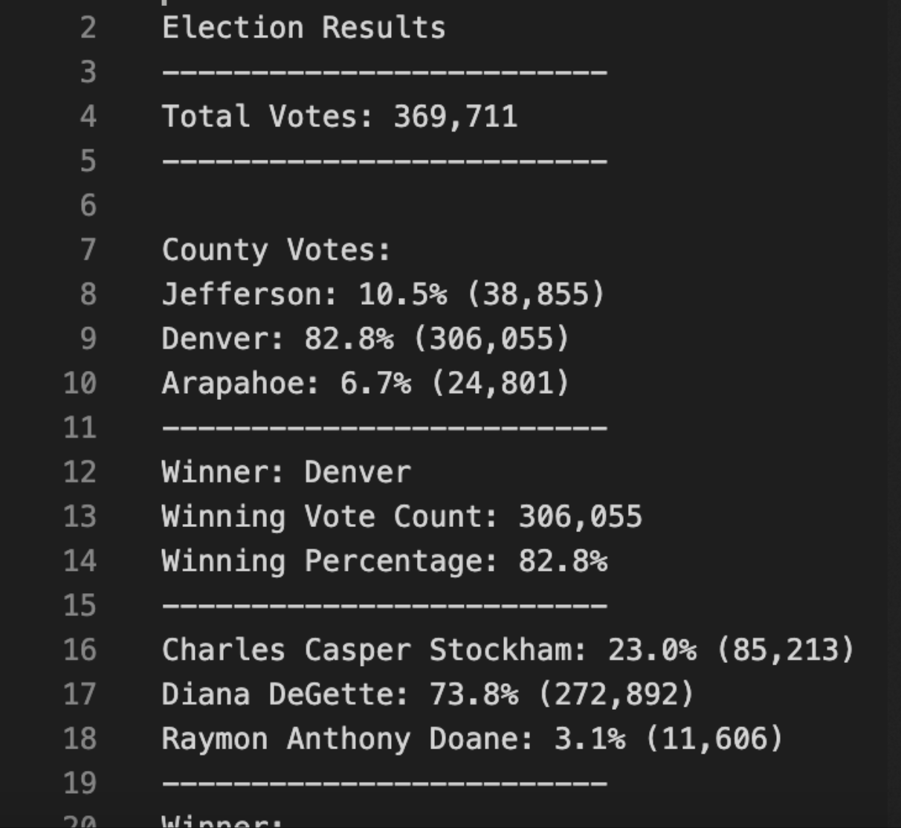

# Election_Analysis

# Overview of Election Audit
Tom, a Coloardo Board of elections employee, requested an audit of a local election. The goal of the audit is to establish the following:
- Calaculate the total number of votes casted.
- Obtain a list of candidates who received those votes.
- Calcualte the number of votes the candidates won by.
- Calaucate the percentage of the votes each candidates won by.
- Determine the winner of the election based on popular vote. 

# Election Audit Results
The analysis illustrated the following:
  - There were 369,711 votes cast in the election.
  - The candidates were:
        - Charles Casper Stockham
        - Diana DeGette
        - Raymon Anthony Doane
   - The candidate results were:
        - Charles Casper Stockham received 23.0% of vote and 85,213 number of votes.
        - Diana DeGette received 73.8% of vote and 272,892 number of votes.
        - Raymon Anthony Doane received 3.1% of vote and 11, 606 number of votes.
    - The winner of the election was Diana DeGette. She received 73.8% of the vote and she obtained a vote count number of 272,892.
    
The results can be further shown by the following images:
Image 1. 

Image 2. 

    
# Election-Audit Summary

This script can be used for any election given certain modifications. The script correctly identifies the vote counts, the percentage of votes won in each county and the votes won by each candidate. This script can further illustrate more analysis by giving us an illustration of the percentage of votes won in each county by each candidate. This is useful for election campaign data and can show us the difference between any hand picked votes and the votes tabulated and processed by this script.
